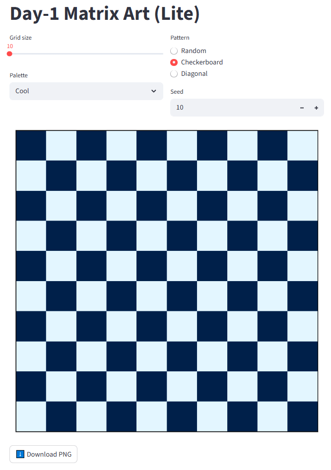

# 🎯 90 Days ML + AI Challenge

Welcome to my **90-Day Machine Learning & AI Development Challenge** 🚀  
Every day, I will learn and build **practical AI/ML projects** — one step at a time.  
This repository will contain **daily project code, datasets, outputs, and progress updates**.

---

## 📅 Day 1 – Matrix Art Generator (Lite)

**Goal:**  
Learn Python basics & NumPy while creating a fun **Matrix / Pixel Art Generator** with a simple UI using **Streamlit**.

**Tasks Completed:**
- Created a Streamlit app to:
  - Select **grid size**
  - Choose **color palette**
  - Pick **pattern** (Random / Checkerboard / Diagonal)
  - Set a **seed** for reproducible patterns
  - **Download** the generated art as PNG
- Learned:
  - NumPy array creation & manipulation
  - Random number generation
  - Streamlit UI components (`slider`, `selectbox`, `radio`, `number_input`, `download_button`)
  - Matplotlib for plotting grids with custom colors

**Run the Project:**
```bash
# Install dependencies
pip install streamlit numpy matplotlib

# Run the app
streamlit run Day1_MatrixArt_Lite.py
